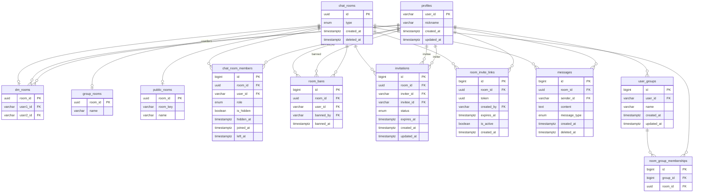

# ERD — 데이터 모델 정의

## 테이블 목록

| 테이블 | PK 타입 | 역할 |
|--------|---------|------|
| `profiles` | VARCHAR (JWT sub) | 사용자 부가 정보 |
| `chat_rooms` | UUID | 채팅방 공통 base |
| `dm_rooms` | UUID (FK) | DM 전용 컬럼 (user1, user2) |
| `group_rooms` | UUID (FK) | GROUP 전용 컬럼 (name) |
| `public_rooms` | UUID (FK) | PUBLIC 전용 컬럼 (room_key, name) |
| `chat_room_members` | BIGINT | 채팅방 참여 멤버 및 상태 |
| `room_bans` | BIGINT | 채팅방 강퇴 이력 |
| `invitations` | BIGINT | 직접 초대 |
| `room_invite_links` | BIGINT | 초대 URI 링크 토큰 |
| `messages` | BIGINT (Snowflake) | 채팅 메시지 |
| `read_cursors` (Redis) | — | 멤버별 읽음 커서 |
| `user_groups` | BIGINT | 사용자 정의 채팅방 그룹 |
| `room_group_memberships` | BIGINT | 채팅방-그룹 연결 |

---

## 테이블 상세

### profiles
사용자 부가 정보. JWT `sub` 클레임이 PK이므로 별도 users 테이블 없음.

| 컬럼 | 타입 | 제약 | 설명 |
|------|------|------|------|
| `user_id` | VARCHAR | PK | JWT sub 클레임 값 |
| `nickname` | VARCHAR(50) | NOT NULL | 표시 이름 |
| `created_at` | TIMESTAMPTZ | NOT NULL | 생성 시각 |
| `updated_at` | TIMESTAMPTZ | NOT NULL | 수정 시각 |

---

### chat_rooms
채팅방 공통 base 테이블. 타입별 세부 정보는 서브 테이블에 위임.

| 컬럼 | 타입 | 제약 | 설명 |
|------|------|------|------|
| `id` | UUID | PK | 채팅방 ID |
| `type` | ENUM | NOT NULL | `DM` / `GROUP` / `PUBLIC` |
| `created_at` | TIMESTAMPTZ | NOT NULL | 생성 시각 |
| `deleted_at` | TIMESTAMPTZ | | 소프트 삭제 시각. NULL이면 활성 채팅방 |

**제약**
- `deleted_at IS NULL`인 경우만 활성 채팅방으로 간주
- 삭제 시 메시지·멤버·초대 데이터는 유지. 조회 쿼리에 `WHERE deleted_at IS NULL` 조건 추가

**소프트 삭제 후 재생성 처리**
- DM: 삭제된 방이 있는 상태에서 같은 두 사람이 DM 요청 시 → `chat_rooms.deleted_at = NULL`로 재활성화. `dm_rooms`의 `UNIQUE(user1_id, user2_id)` 제약 때문에 새 INSERT 불가이므로 재활성화가 유일한 방법.
- PUBLIC: 삭제된 `room_key`와 동일한 키로 새 채널 생성 요청 시 → `CHAT_ROOM_ALREADY_EXISTS` 에러 반환. room_key 재사용 불가.

---

### dm_rooms
DM 전용 서브 테이블.

| 컬럼 | 타입 | 제약 | 설명 |
|------|------|------|------|
| `room_id` | UUID | PK, FK → chat_rooms | |
| `user1_id` | VARCHAR | NOT NULL, FK → profiles | 사전순 정렬 시 앞선 사용자 |
| `user2_id` | VARCHAR | NOT NULL, FK → profiles | 사전순 정렬 시 뒤선 사용자 |

**제약**
- `(user1_id, user2_id)` UNIQUE — DB 레벨 DM 중복 방지
- 저장 규칙: `user1_id < user2_id` 강제 (사전순 정렬). 서비스 레이어에서 정렬 후 저장
  ```
  "user-b", "user-a" 요청 → user1_id = "user-a", user2_id = "user-b" 로 저장
  ```

---

### group_rooms
GROUP 전용 서브 테이블.

| 컬럼 | 타입 | 제약 | 설명 |
|------|------|------|------|
| `room_id` | UUID | PK, FK → chat_rooms | |
| `name` | VARCHAR(100) | NOT NULL | 그룹 이름 |

---

### public_rooms
PUBLIC 전용 서브 테이블.

| 컬럼 | 타입 | 제약 | 설명 |
|------|------|------|------|
| `room_id` | UUID | PK, FK → chat_rooms | |
| `room_key` | VARCHAR(100) | NOT NULL UNIQUE | 채널 식별용 슬러그 |
| `name` | VARCHAR(100) | NOT NULL | 채널 이름 |

---

### chat_room_members
채팅방에 속한 멤버 및 상태 정보. 모든 타입 공통.

| 컬럼 | 타입 | 제약 | 설명 |
|------|------|------|------|
| `id` | BIGINT | PK | |
| `room_id` | UUID | FK → chat_rooms | |
| `user_id` | VARCHAR | FK → profiles | |
| `role` | ENUM | NOT NULL | `OWNER` / `ADMIN` / `MEMBER` |
| `is_hidden` | BOOLEAN | NOT NULL DEFAULT false | 나만 숨기기 여부 |
| `hidden_at` | TIMESTAMPTZ | | 숨김 처리 시각 |
| `joined_at` | TIMESTAMPTZ | NOT NULL | 참여 시각 |
| `left_at` | TIMESTAMPTZ | | 나가기 시각 |

**제약**
- `(room_id, user_id)` UNIQUE
- `left_at IS NULL`인 경우만 활성 멤버로 간주

**재참여 처리**
- PUBLIC 채널 재참여, 초대 링크 참여, 직접 초대 수락 모두 해당. 기존 row가 있으면 새 row INSERT 금지 (UNIQUE 충돌)
- `room_bans`에 해당 사용자 레코드가 있으면 재참여 차단 → `MEMBER_KICKED_OUT` 에러 반환 (직접 초대 수락 시에는 `room_bans` 삭제 후 복귀)
- `left_at IS NOT NULL`인 사용자는 재활성화: `left_at = NULL`, `joined_at = 현재 시각`, `role = MEMBER`, `is_hidden = false`, `hidden_at = NULL`
- 서비스 레이어에서 `findByRoomIdAndUserId`로 기존 row 확인 후 분기

---

### room_bans
채팅방에서 강퇴된 사용자 이력. 강퇴된 사용자의 재참여 차단에 사용.

| 컬럼 | 타입 | 제약 | 설명 |
|------|------|------|------|
| `id` | BIGINT | PK | |
| `room_id` | UUID | FK → chat_rooms | |
| `user_id` | VARCHAR | FK → profiles | 강퇴된 사용자 |
| `banned_by` | VARCHAR | FK → profiles | 강퇴를 실행한 사용자 (OWNER/ADMIN) |
| `banned_at` | TIMESTAMPTZ | NOT NULL | 강퇴 시각 |

**제약**
- `(room_id, user_id)` UNIQUE — 동일 방에서 동일 사용자 강퇴 이력은 1건만 유지 (재강퇴 시 갱신)
- OWNER/ADMIN이 강퇴 취소 시 해당 레코드 삭제 → 이후 초대 가능

---

### invitations
특정 사용자를 채팅방에 직접 초대하는 초대장.

| 컬럼 | 타입 | 제약 | 설명 |
|------|------|------|------|
| `id` | BIGINT | PK | |
| `room_id` | UUID | FK → chat_rooms | |
| `inviter_id` | VARCHAR | FK → profiles | 초대한 사용자 |
| `invitee_id` | VARCHAR | FK → profiles | 초대받은 사용자 |
| `status` | ENUM | NOT NULL DEFAULT 'PENDING' | `PENDING` / `ACCEPTED` / `REJECTED` |
| `expires_at` | TIMESTAMPTZ | NOT NULL | 초대 만료 시각 |
| `created_at` | TIMESTAMPTZ | NOT NULL | |
| `updated_at` | TIMESTAMPTZ | NOT NULL | 수락/거절 시각 추적 |

**제약**
- 동일한 `(room_id, invitee_id)` 조합은 `PENDING` 상태가 1건만 존재 가능 (partial unique index)

---

### room_invite_links
링크를 통한 채팅방 참여를 위한 초대 URI 토큰.

| 컬럼 | 타입 | 제약 | 설명 |
|------|------|------|------|
| `id` | BIGINT | PK | |
| `room_id` | UUID | FK → chat_rooms | |
| `token` | UUID | UNIQUE NOT NULL | 링크 토큰 (URL에 포함) |
| `created_by` | VARCHAR | FK → profiles | 링크 생성자 |
| `expires_at` | TIMESTAMPTZ | NOT NULL | 링크 만료 시각 |
| `is_active` | BOOLEAN | NOT NULL DEFAULT true | 수동 비활성화 여부 |
| `created_at` | TIMESTAMPTZ | NOT NULL | |

---

### messages
채팅방 메시지. 철회는 소프트 삭제로 처리.

| 컬럼 | 타입 | 제약 | 설명 |
|------|------|------|------|
| `id` | BIGINT | PK (Snowflake ID — timestamp 인코딩, 정렬 가능) | |
| `room_id` | UUID | FK → chat_rooms | |
| `sender_id` | VARCHAR | FK → profiles | |
| `content` | TEXT | | 메시지 본문. 철회 시 NULL로 갱신. 생성 시 서비스 레이어에서 빈값 검증 |
| `message_type` | ENUM | NOT NULL DEFAULT 'TEXT' | `TEXT` / `IMAGE` / `FILE` |
| `created_at` | TIMESTAMPTZ | NOT NULL | 전송 시각 |
| `deleted_at` | TIMESTAMPTZ | | 철회 시각 (NULL이면 정상 메시지) |

---

### read_cursors (Redis)
멤버별 채팅방 읽음 위치 추적. DB 테이블 없이 Redis로 관리.

**키 구조**
```
// 메시지 순서 인덱스 (Sorted Set) — score = Snowflake ID
messages:{room_id}  →  SortedSet { score: {snowflake_id}, member: {snowflake_id} }

// 읽음 커서 (Hash) — value = 마지막으로 읽은 Snowflake ID
read_cursor:{room_id}  →  Hash { {user_id}: {snowflake_id} }
```

**동작 방식**
- 메시지 전송 시: `ZADD messages:{room_id} {snowflake_id} {snowflake_id}`
- 읽음 처리 시: `HSET read_cursor:{room_id} {user_id} {snowflake_id}`
- 안읽은 수: `ZCOUNT messages:{room_id} {last_id+1} +inf`
- 커서 기반 조회: `ZRANGEBYSCORE messages:{room_id} {cursor_id} +inf LIMIT 0 20`
- 오래된 인덱스 정리: `ZREMRANGEBYRANK messages:{room_id} 0 -1001` (최근 1000개 유지)
- Redis 장애 시: DB에서 `id > {last_id}` 로 fallback (RedisConnectionFailureException 발생 시 자동 전환)

**TTL 정책**
- `messages:{room_id}`: TTL 미설정. 채팅방 삭제 시 `DEL messages:{room_id}` 명시적 삭제
- `read_cursor:{room_id}`: TTL 미설정. 채팅방 삭제 시 `DEL read_cursor:{room_id}` 명시적 삭제

---

### user_groups
사용자가 채팅방 목록을 묶는 사용자 정의 그룹.

| 컬럼 | 타입 | 제약 | 설명 |
|------|------|------|------|
| `id` | BIGINT | PK | |
| `user_id` | VARCHAR | FK → profiles | 그룹 소유자 |
| `name` | VARCHAR(50) | NOT NULL | 그룹 이름 |
| `created_at` | TIMESTAMPTZ | NOT NULL | |
| `updated_at` | TIMESTAMPTZ | NOT NULL | |

---

### room_group_memberships
채팅방과 사용자 그룹의 연결 테이블.

| 컬럼 | 타입 | 제약 | 설명 |
|------|------|------|------|
| `id` | BIGINT | PK | |
| `group_id` | BIGINT | FK → user_groups | |
| `room_id` | UUID | FK → chat_rooms | |

**제약**
- `(group_id, room_id)` UNIQUE

---

## 관계 정의

```
profiles          1 ─── N   chat_room_members
profiles          1 ─── N   messages
profiles          1 ─── N   invitations (inviter)
profiles          1 ─── N   invitations (invitee)
profiles          1 ─── N   room_invite_links
profiles          1 ─── N   dm_rooms (user1)
profiles          1 ─── N   dm_rooms (user2)
profiles          1 ─── N   user_groups
profiles          1 ─── N   room_bans (user)
profiles          1 ─── N   room_bans (banned_by)

chat_rooms        1 ─── 1   dm_rooms
chat_rooms        1 ─── 1   group_rooms
chat_rooms        1 ─── 1   public_rooms
chat_rooms        1 ─── N   chat_room_members
chat_rooms        1 ─── N   room_bans
chat_rooms        1 ─── N   invitations
chat_rooms        1 ─── N   room_invite_links
chat_rooms        1 ─── N   messages
chat_rooms        N ─── M   user_groups  (room_group_memberships)

user_groups       1 ─── N   room_group_memberships

// 읽음 커서는 Redis에서 관리 (DB 관계 없음)
// messages:{room_id} SortedSet  →  { score: snowflake_id }
// read_cursor:{room_id} Hash    →  { user_id: snowflake_id }
```

---

## Snowflake ID — Machine ID 관리

`messages.id`는 Snowflake ID (64bit = 41bit 타임스탬프 + 10bit machineId + 12bit sequence).

**분산 환경에서 machineId 충돌 방지**
- 각 서버 인스턴스는 고유한 `machineId` (0~1023)를 가져야 함
- 설정 방법: 환경변수 `SNOWFLAKE_MACHINE_ID` 외부 주입

```yaml
# application.yml
snowflake:
  machine-id: ${SNOWFLAKE_MACHINE_ID:0}  # 기본값 0 (단일 인스턴스용)
```

```
서버 인스턴스1  →  SNOWFLAKE_MACHINE_ID=1
서버 인스턴스2  →  SNOWFLAKE_MACHINE_ID=2
서버 인스턴스3  →  SNOWFLAKE_MACHINE_ID=3
```

---

## ERD 다이어그램


