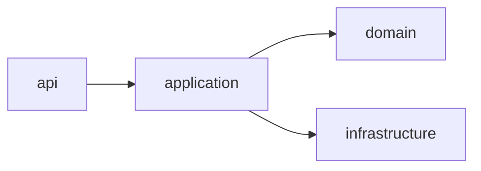
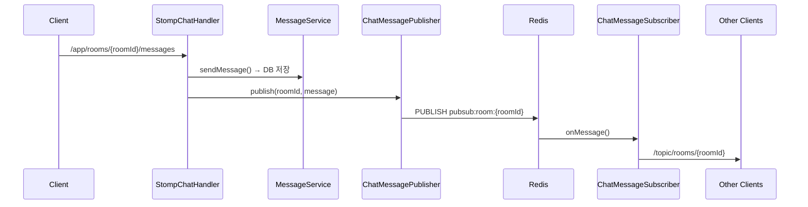

# chat-spring

Spring Boot 기반 실시간 채팅 백엔드 서버.

## 어떤 프로젝트인가

DM(1:1) 및 그룹 채팅을 지원하는 REST API + WebSocket 백엔드 서버다.
OAuth2 Resource Server로 동작하며, 외부 인증 서버에서 발급된 JWT로 사용자를 식별한다.
Redis Pub/Sub을 통해 다중 인스턴스 환경에서도 실시간 메시지 브로드캐스트가 가능하도록 설계했다.

**기술 스택:** Java 21 · Spring Boot 4.0.6 · PostgreSQL · Redis · STOMP WebSocket

---

## 왜 구현하기 시작했는가

실시간 채팅 시스템을 직접 설계하고 구현하면서 아래 주제들을 학습하기 위해 시작했다.

- STOMP over WebSocket 실시간 메시지 처리
- Redis Pub/Sub 기반 멀티 인스턴스 수평 확장 구조
- OAuth2 Resource Server 패턴 (users 테이블 없이 JWT subject로 사용자 식별)
- 커서 기반 페이징, Soft Delete, 온라인 상태 관리 등 실무 패턴

---

## 핵심 구현 기능

### 채팅방
- DM 방 find-or-create (멱등) — DB UNIQUE 인덱스로 중복 차단
- 그룹 채팅방 생성 · 멤버 초대 · 채팅방 나가기
- 채팅방 목록 조회 (최근 메시지 순 정렬, 읽지 않은 메시지 수 포함)

### 메시지
- 실시간 메시지 전송 (STOMP → Redis Pub/Sub → 브로드캐스트)
- 커서 기반 메시지 히스토리 페이징 (`before`, `size` 파라미터)
- 본인 메시지 Soft Delete

### 실시간
- WebSocket STOMP 연결 · 메시지 수신 (`/topic/rooms/{roomId}`)
- 개인 알림 채널 (`/user/queue/notifications`) — 초대 알림
- 온라인 상태 관리 — Redis TTL 60s, disconnect 즉시 오프라인 처리

---

## 트러블슈팅

Spring Boot 4.x 마이그레이션 과정에서 발생한 주요 이슈들이다. 자세한 내용은 [`.claude/docs/troubleshooting.md`](.claude/docs/troubleshooting.md) 참고.

| # | 문제 | 해결 |
|---|------|------|
| 001 | `@WebMvcTest` import 경로 변경 | `org.springframework.boot.webmvc.test.autoconfigure.WebMvcTest` 사용 |
| 002 | `@WebMvcTest`에서 `ObjectMapper` 주입 불가 | `new ObjectMapper()` 직접 생성 |
| 004 | `@MockBean` 제거 | `@MockitoBean`으로 교체 |
| 008 | `@WithMockUser`로 `@AuthenticationPrincipal Jwt` null | `SecurityMockMvcRequestPostProcessors.jwt()` 사용 |
| 011 | H2 + Flyway `GENERATED ALWAYS AS IDENTITY` 문법 오류 | 로컬에서 Flyway 비활성화 + `ddl-auto: create-drop` |

---

## 아키텍처

### 전체 구조

```mermaid
graph TD
    Client -->|REST API| SC[SecurityFilterChain]
    Client -->|WebSocket CONNECT| WS[JwtChannelInterceptor]

    SC --> RC[RoomController]
    SC --> MC[MessageController]
    SC --> PC[PresenceController]

    RC --> RS[RoomService]
    MC --> MS[MessageService]

    RS --> DB[(PostgreSQL)]
    MS --> DB

    WS --> SCH[StompChatHandler]
    WS --> SPH[StompPresenceHandler]

    SCH --> MS
    SCH --> PUB[ChatMessagePublisher]
    SPH --> PS[PresenceService]

    PUB -->|pubsub:room| Redis[(Redis)]
    PS -->|user:online TTL 60s| Redis

    Redis --> SUB[ChatMessageSubscriber]
    SUB -->|/topic/rooms/{roomId}| Client
    SUB -->|/user/queue/notifications| Client
```

### 레이어 구조



### WebSocket 메시지 흐름



---

## Claude Code 활용

이 프로젝트는 [Claude Code](https://claude.ai/code)를 적극적으로 활용해 개발했다.

### 활용 방식

**코드 구현**
- 도메인 레이어(Entity, Service, Repository) 초기 구현
- Spring Boot 4.x 마이그레이션 이슈 진단 및 수정
- 테스트 코드 작성 (`@WebMvcTest`, `@ExtendWith(MockitoExtension.class)`)

**프로젝트 관리**
- `.claude/rules/` — 아키텍처·코딩 컨벤션 문서화 (11개 파일)
- `.claude/docs/troubleshooting.md` — 문제 해결 기록 자동 관리
- `.claude/docs/history.md` — 구현 현황 추적

**CI/CD**
- GitHub Actions + Discord Bot API 연동으로 PR 자동 코드 리뷰 워크플로 구성
- PR 오픈 시 Discord에 알림 → 라즈베리파이 Claude Code 에이전트가 자동 리뷰
