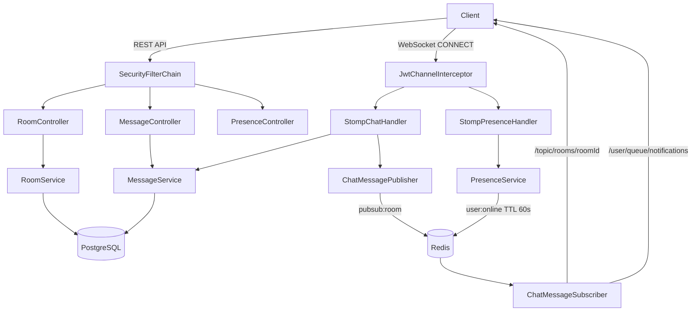
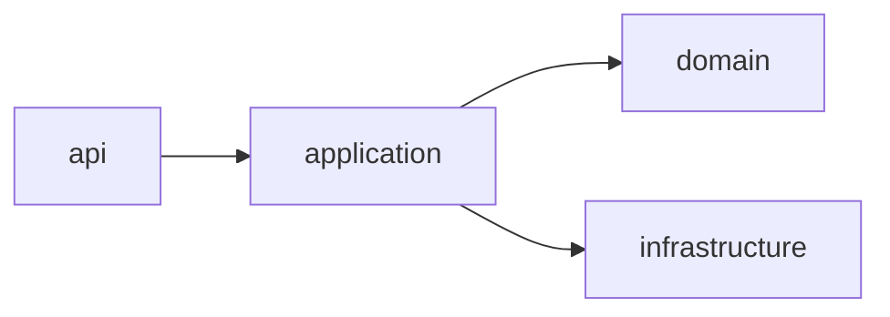
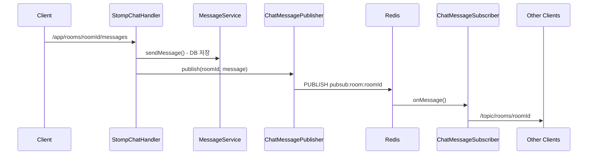

# chat-spring

Spring Boot 기반 실시간 채팅 백엔드 서버.

## 어떤 프로젝트인가

DM(1:1) 및 그룹 채팅을 지원하는 REST API + WebSocket 백엔드 서버다.
OAuth2 Resource Server로 동작하며, 외부 인증 서버에서 발급된 JWT로 사용자를 식별한다.
Redis Pub/Sub을 통해 다중 인스턴스 환경에서도 실시간 메시지 브로드캐스트가 가능하도록 설계했다.

**기술 스택:** Java 21 · Spring Boot 4.0.6 · PostgreSQL · Redis · STOMP WebSocket

---

## 왜 구현하기 시작했는가

실시간 채팅 시스템을 직접 설계하고 구현하면서 아래 주제들을 학습하기 위해 시작했다.

- STOMP over WebSocket 실시간 메시지 처리
- Redis Pub/Sub 기반 멀티 인스턴스 수평 확장 구조
- OAuth2 Resource Server 패턴 (users 테이블 없이 JWT subject로 사용자 식별)
- 커서 기반 페이징, Soft Delete, 온라인 상태 관리 등 실무 패턴

---

## 핵심 구현 기능

### 채팅방
- DM 방 find-or-create (멱등) — DB UNIQUE 인덱스로 중복 차단
- 그룹 채팅방 생성 · 멤버 초대 · 채팅방 나가기
- 채팅방 목록 조회 (최근 메시지 순 정렬, 읽지 않은 메시지 수 포함)

### 메시지
- 실시간 메시지 전송 (STOMP → Redis Pub/Sub → 브로드캐스트)
- 커서 기반 메시지 히스토리 페이징 (`before`, `size` 파라미터)
- 본인 메시지 Soft Delete

### 실시간
- WebSocket STOMP 연결 · 메시지 수신 (`/topic/rooms/{roomId}`)
- 개인 알림 채널 (`/user/queue/notifications`) — 초대 알림
- 온라인 상태 관리 — Redis TTL 60s, disconnect 즉시 오프라인 처리

---

## 트러블슈팅

Spring Boot 4.x 마이그레이션 과정에서 발생한 주요 이슈들이다. 자세한 내용은 [`.claude/docs/troubleshooting.md`](.claude/docs/troubleshooting.md) 참고.

| # | 문제 | 해결 |
|---|------|------|
| 001 | `@WebMvcTest` import 경로 변경 | `org.springframework.boot.webmvc.test.autoconfigure.WebMvcTest` 사용 |
| 002 | `@WebMvcTest`에서 `ObjectMapper` 주입 불가 | `new ObjectMapper()` 직접 생성 |
| 004 | `@MockBean` 제거 | `@MockitoBean`으로 교체 |
| 008 | `@WithMockUser`로 `@AuthenticationPrincipal Jwt` null | `SecurityMockMvcRequestPostProcessors.jwt()` 사용 |
| 011 | H2 + Flyway `GENERATED ALWAYS AS IDENTITY` 문법 오류 | 로컬에서 Flyway 비활성화 + `ddl-auto: create-drop` |

---

## 아키텍처

### 전체 구조



### 레이어 구조



### WebSocket 메시지 흐름



---

## 구현 상세

### 🔎 Redis Pub/Sub을 활용한 실시간 메시지 브로드캐스트

**문제**

서버 인스턴스가 여러 개일 때 WebSocket 세션은 각 인스턴스 메모리에만 존재한다. 클라이언트 A가 인스턴스 1에, 클라이언트 B가 인스턴스 2에 연결된 상황에서 A의 메시지를 B에게 전달할 방법이 없다.

**해결**

메시지를 DB에 저장한 뒤 `pubsub:room:{roomId}` 채널에 publish한다. 모든 인스턴스의 `ChatMessageSubscriber`가 해당 채널을 구독하고 있으므로, 어느 인스턴스에서 publish하든 자신에게 연결된 클라이언트에게 STOMP로 전달한다.

```
Client → StompChatHandler → MessageService(DB 저장)
                          → ChatMessagePublisher
                               → Redis PUBLISH pubsub:room:{roomId}
                                    → ChatMessageSubscriber (모든 인스턴스)
                                         → /topic/rooms/{roomId}
```

```java
// ChatMessagePublisher
stringRedisTemplate.convertAndSend("pubsub:room:" + roomId,
        objectMapper.writeValueAsString(message));

// ChatMessageSubscriber
messagingTemplate.convertAndSend("/topic/rooms/" + roomId, broadcast);
// 개인 알림 채널
messagingTemplate.convertAndSendToUser(userId, "/queue/notifications", notification);
```

Redis가 인스턴스 간 메시지 버스 역할을 담당하므로 수평 확장 시 코드 변경 없이 인스턴스를 추가할 수 있다.

---

### 🔎 STOMP WebSocket JWT 인증

**문제**

HTTP REST 요청은 `SecurityFilterChain`에서 JWT를 검증하지만, WebSocket CONNECT 시점에는 표준 SecurityFilterChain이 동작하지 않는다. WebSocket 업그레이드 후 연결을 맺은 클라이언트의 신원을 이후 모든 STOMP 프레임에서 사용할 수 있어야 한다.

**해결**

`ChannelInterceptor`를 구현한 `JwtChannelInterceptor`를 등록한다. STOMP CONNECT 프레임에서만 동작하며, `Authorization` 헤더에서 Bearer 토큰을 추출해 `JwtDecoder`로 검증한 뒤 `JwtPrincipal`을 세션에 바인딩한다.

```java
// JwtChannelInterceptor — CONNECT 프레임에서만 실행
if (StompCommand.CONNECT.equals(accessor.getCommand())) {
    Jwt jwt = jwtDecoder.decode(extractToken(accessor));  // 검증 실패 시 예외
    accessor.setUser(new JwtPrincipal(jwt));
    log.info("[WS_CONNECT] userId={}", jwt.getSubject());
}

// StompChatHandler — 이후 모든 프레임에서 Principal로 사용자 식별
String userId = principal.getName();  // JwtPrincipal.getName() = jwt.getSubject()
```

WebSocket 업그레이드 경로(`/ws/chat`)는 `permitAll`로 공개하되, STOMP CONNECT 레벨에서 인증을 강제한다. 토큰 없이 CONNECT 시 `MessageDeliveryException`을 던져 연결이 차단된다.

---

### 🔎 OAuth2 Resource Server + 로컬 HMAC JWT 검증

**문제**

운영 환경에서는 외부 Authorization Server가 RSA로 서명한 JWT를 JWKS 엔드포인트로 검증한다. 그러나 로컬 개발 환경에서는 외부 인증 서버 없이도 JWT 인증 플로우 전체를 테스트할 수 있어야 한다.

**해결**

`@Profile("local")`로만 활성화되는 `LocalJwtConfig`에서 HMAC HS256 방식의 `JwtDecoder`를 빈으로 등록한다. `application-local.yml`의 `app.jwt.local-secret`을 공유 시크릿으로 사용해 서명·검증한다.

```java
@Configuration
@Profile("local")
public class LocalJwtConfig {
    @Bean
    public JwtDecoder jwtDecoder() {
        SecretKey key = new SecretKeySpec(
                secret.getBytes(StandardCharsets.UTF_8), MacAlgorithm.HS256.getName());
        return NimbusJwtDecoder.withSecretKey(key)
                .macAlgorithm(MacAlgorithm.HS256)
                .build();
    }
}
```

운영 프로파일에서는 `spring.security.oauth2.resourceserver.jwt.issuer-uri`만 설정하면 Spring Security가 JWKS 엔드포인트를 통해 RSA 공개키를 자동 조회해 검증한다. `SecurityConfig`, `JwtChannelInterceptor` 등 상위 레이어는 `JwtDecoder` 인터페이스만 사용하므로 코드 변경 없이 환경별 검증 방식이 교체된다.

---

### 🔎 커서 기반 메시지 페이징

**문제**

오프셋 기반 페이징(`LIMIT n OFFSET m`)은 OFFSET이 클수록 DB가 앞 행을 모두 스캔해 성능이 저하된다. 채팅처럼 메시지가 빠르게 쌓이는 환경에서는 페이지 이동 중 새 메시지가 삽입되면 동일 메시지가 중복 조회되거나 누락될 수 있다.

**해결**

마지막으로 조회한 메시지의 `id`를 커서로 사용한다. `before` 파라미터에 커서를 전달하면 `id < before` 조건으로 PK 인덱스를 활용한 범위 스캔을 수행한다. `size + 1`개를 조회해 다음 페이지 존재 여부(`hasMore`)를 판단하고, 실제 응답은 `size`개만 반환한다.

```java
// size + 1 조회로 hasMore 판단
PageRequest pageable = PageRequest.of(0, size + 1);
List<Message> fetched = before != null
        ? messageRepository.findByRoomIdAndIdLessThanOrderByIdDesc(roomId, before, pageable)
        : messageRepository.findByRoomIdOrderByIdDesc(roomId, pageable);

boolean hasMore = fetched.size() > size;
List<Message> page = hasMore ? fetched.subList(0, size) : fetched;
Long nextCursor = hasMore ? page.get(page.size() - 1).getId() : null;

return new MessageCursorResponse(
        page.stream().map(MessageResponse::from).toList(),
        nextCursor,   // null이면 마지막 페이지
        hasMore
);
```

PK(`id`) 인덱스를 직접 사용하므로 데이터 규모에 무관하게 일정한 응답 성능을 유지한다. 새 메시지가 삽입되어도 커서 이전의 데이터 집합은 변하지 않으므로 중복·누락이 없다.

---

### 🔎 Redis TTL 기반 온라인 상태 관리

**문제**

WebSocket 연결 상태만으로 온라인 여부를 판단하면 네트워크 단절 등 비정상 종료 시 오프라인 처리가 되지 않는다. 다중 인스턴스 환경에서는 인스턴스별 메모리에 상태를 저장할 수 없다.

**해결**

Heartbeat와 Disconnect 두 가지 메커니즘을 조합했다.

- **Heartbeat:** 클라이언트는 `/app/presence/heartbeat`로 주기적으로 신호를 보낸다. `PresenceService`는 `user:online:{userId}` 키를 TTL 60초로 갱신한다.
- **Disconnect:** `SessionDisconnectEvent` 발생 시 즉시 키를 삭제한다.

TTL 60초 내에 heartbeat가 없으면 Redis가 키를 자동 만료시켜 오프라인으로 판단된다.

```java
// PresenceService
public void heartbeat(String userId) {
    stringRedisTemplate.opsForValue()
            .set("user:online:" + userId, "1", Duration.ofSeconds(60));
}

public void offline(String userId) {
    stringRedisTemplate.delete("user:online:" + userId);
}

// StompPresenceHandler — 정상/비정상 종료 모두 처리
@EventListener
public void onDisconnect(SessionDisconnectEvent event) {
    presenceService.offline(event.getUser().getName());
}
```

네트워크 단절·브라우저 강제 종료에도 최대 60초 내에 오프라인으로 전환된다. Redis 키로 관리하므로 다중 인스턴스에서 상태가 공유된다.

---

### 🔎 GitHub Actions + Discord Bot API 기반 PR 자동 코드 리뷰

**문제**

PR을 열 때마다 수동으로 리뷰를 요청해야 하는 번거로움을 없애고, 코드 리뷰 사이클을 자동화하고 싶었다.

**해결**

GitHub Actions가 PR 오픈·업데이트 시 Discord Bot API로 지정 채널에 에이전트 멘션 메시지를 전송한다. 라즈베리파이에서 Claude Code CLI를 Discord Bot과 연동해 실행 중이며, 멘션 수신 시 PR URL을 읽어 자동으로 코드를 분석하고 리뷰 결과를 Discord에 응답한다.

```
PR 오픈
  → GitHub Actions (pr-review.yml)
  → Discord Bot API v10 — Bot Token 인증
  → #code-review 채널에 에이전트 멘션
  → 라즈베리파이 Claude Code 에이전트 감지
  → PR URL 읽어 자동 리뷰 수행
  → Discord에 리뷰 코멘트 응답
```

```yaml
- name: Send to Discord via Bot
  run: |
    curl -X POST "https://discord.com/api/v10/channels/${{ secrets.DISCORD_CHANNEL_ID }}/messages" \
      -H "Authorization: Bot ${{ secrets.DISCORD_BOT_TOKEN }}" \
      -H "Content-Type: application/json" \
      -d '{
        "content": "<@agent-id> **PR 리뷰 요청**\n제목: ${{ github.event.pull_request.title }}\nURL: ${{ github.event.pull_request.html_url }}"
      }'
```

**트러블슈팅:** 초기 Discord Webhook 방식은 `author.bot = true`로 표시되어 에이전트가 자신의 메시지를 무시하는 문제가 있었다. Bot Token 방식(Discord API v10)으로 전환하고, 에이전트 측 `server.ts`에서 봇 메시지를 필터링하는 로직을 제거해 해결했다.

---

## Claude Code 활용

이 프로젝트는 [Claude Code](https://claude.ai/code)를 적극적으로 활용해 개발했다.

### 활용 방식

**코드 구현**
- 도메인 레이어(Entity, Service, Repository) 초기 구현
- Spring Boot 4.x 마이그레이션 이슈 진단 및 수정
- 테스트 코드 작성 (`@WebMvcTest`, `@ExtendWith(MockitoExtension.class)`)

**프로젝트 관리**
- `.claude/rules/` — 아키텍처·코딩 컨벤션 문서화 (11개 파일)
- `.claude/docs/troubleshooting.md` — 문제 해결 기록 자동 관리
- `.claude/docs/history.md` — 구현 현황 추적

**CI/CD**
- GitHub Actions + Discord Bot API 연동으로 PR 자동 코드 리뷰 워크플로 구성
- PR 오픈 시 Discord에 알림 → 라즈베리파이 Claude Code 에이전트가 자동 리뷰
