# 채팅 서버 데이터베이스 설계

## 목차

1. [개요](#개요)
2. [도메인 구성](#도메인-구성)
3. [ERD](#erd)
4. [테이블 명세](#테이블-명세)
   - [사용자 (User)](#사용자-user)
   - [서버 (Server)](#서버-server)
   - [채널 (Channel)](#채널-channel)
   - [메시지 (Message)](#메시지-message)
   - [친구 (Friend)](#친구-friend)
   - [DM (Direct Message)](#dm-direct-message)
   - [알림 (Notification)](#알림-notification)
5. [ErrorCode 접두사 추가 목록](#errorcode-접두사-추가-목록)
6. [패키지 구조 제안](#패키지-구조-제안)
7. [미결 사항](#미결-사항)

---

## 개요

Discord 방식의 채팅 서버를 위한 DB 설계.

- **인증**: 외부 인증 서버(OAuth2 JWT)에서 발급한 토큰으로 사용자를 식별한다. JWT `sub` 클레임을 `users.external_id`에 저장하고 내부 `BIGINT id`로 관계를 맺는다.
- **채널 계층**: Server → Category → Channel
- **메시지 구조**: 채널 메시지와 DM 메시지를 별도 테이블로 분리한다. 데이터 성격이 다르고, 각각 독립적으로 확장될 가능성이 높기 때문이다.
- **소프트 삭제**: 메시지는 `deleted_at`으로 소프트 삭제한다. 삭제된 메시지 자리를 UI에 표시할 수 있다.

---

## 도메인 구성

| 도메인 | 역할 |
|--------|------|
| `user` | 사용자 프로필, 상태, 차단 |
| `server` | 서버(길드), 멤버, 역할, 초대 |
| `channel` | 카테고리, 채널, 채널 권한 |
| `message` | 채널 메시지, 첨부파일, 반응, 읽음 상태 |
| `friend` | 친구 요청, 친구 관계 |
| `dm` | DM 채널, DM 메시지, DM 읽음 상태 |
| `notification` | 알림, 알림 설정 |

---

## ERD

```mermaid
erDiagram

%% ===================== USER =====================
users {
    BIGINT id PK
    VARCHAR external_id UK "JWT sub"
    VARCHAR username UK
    VARCHAR display_name
    VARCHAR avatar_url
    ENUM status "ONLINE|OFFLINE|IDLE|DND"
    TIMESTAMP created_at
    TIMESTAMP updated_at
}

user_blocks {
    BIGINT id PK
    BIGINT blocker_id FK
    BIGINT blocked_id FK
    TIMESTAMP created_at
}

%% ===================== SERVER =====================
servers {
    BIGINT id PK
    BIGINT owner_id FK
    VARCHAR name
    VARCHAR description
    VARCHAR icon_url
    VARCHAR invite_code UK
    BOOLEAN is_public
    TIMESTAMP created_at
    TIMESTAMP updated_at
}

server_members {
    BIGINT id PK
    BIGINT server_id FK
    BIGINT user_id FK
    VARCHAR nickname
    TIMESTAMP joined_at
}

server_roles {
    BIGINT id PK
    BIGINT server_id FK
    VARCHAR name
    VARCHAR color
    INT position
    BIGINT permissions "비트필드"
    BOOLEAN is_mentionable
    BOOLEAN is_hoist
    TIMESTAMP created_at
}

server_member_roles {
    BIGINT server_member_id FK
    BIGINT role_id FK
}

server_invites {
    BIGINT id PK
    BIGINT server_id FK
    BIGINT created_by FK
    VARCHAR code UK
    INT max_uses
    INT uses
    TIMESTAMP expires_at
    TIMESTAMP created_at
}

%% ===================== CHANNEL =====================
channel_categories {
    BIGINT id PK
    BIGINT server_id FK
    VARCHAR name
    INT position
    TIMESTAMP created_at
}

channels {
    BIGINT id PK
    BIGINT server_id FK
    BIGINT category_id FK
    ENUM type "TEXT|VOICE|ANNOUNCEMENT|FORUM"
    VARCHAR name
    VARCHAR description
    INT position
    BOOLEAN is_nsfw
    INT slowmode_seconds
    TIMESTAMP created_at
    TIMESTAMP updated_at
}

channel_permission_overwrites {
    BIGINT id PK
    BIGINT channel_id FK
    ENUM target_type "ROLE|MEMBER"
    BIGINT target_id "role_id or server_member_id"
    BIGINT allow_permissions
    BIGINT deny_permissions
}

%% ===================== MESSAGE =====================
messages {
    BIGINT id PK
    BIGINT channel_id FK
    BIGINT sender_id FK
    TEXT content
    ENUM type "DEFAULT|REPLY|SYSTEM"
    BIGINT parent_message_id FK
    BOOLEAN is_edited
    TIMESTAMP created_at
    TIMESTAMP updated_at
    TIMESTAMP deleted_at
}

message_attachments {
    BIGINT id PK
    BIGINT message_id FK
    VARCHAR file_name
    VARCHAR file_url
    BIGINT file_size
    VARCHAR content_type
    TIMESTAMP created_at
}

message_reactions {
    BIGINT id PK
    BIGINT message_id FK
    BIGINT user_id FK
    VARCHAR emoji
    TIMESTAMP created_at
}

message_read_status {
    BIGINT id PK
    BIGINT channel_id FK
    BIGINT user_id FK
    BIGINT last_read_message_id FK
    TIMESTAMP last_read_at
}

pinned_messages {
    BIGINT id PK
    BIGINT channel_id FK
    BIGINT message_id FK
    BIGINT pinned_by FK
    TIMESTAMP pinned_at
}

%% ===================== FRIEND =====================
friend_requests {
    BIGINT id PK
    BIGINT requester_id FK
    BIGINT receiver_id FK
    ENUM status "PENDING|ACCEPTED|REJECTED|CANCELLED"
    TIMESTAMP created_at
    TIMESTAMP updated_at
}

friendships {
    BIGINT id PK
    BIGINT user_id FK
    BIGINT friend_id FK
    TIMESTAMP created_at
}

%% ===================== DM =====================
dm_channels {
    BIGINT id PK
    ENUM type "DIRECT|GROUP"
    VARCHAR name
    VARCHAR icon_url
    TIMESTAMP created_at
}

dm_channel_participants {
    BIGINT id PK
    BIGINT dm_channel_id FK
    BIGINT user_id FK
    TIMESTAMP joined_at
    TIMESTAMP left_at
}

dm_messages {
    BIGINT id PK
    BIGINT dm_channel_id FK
    BIGINT sender_id FK
    TEXT content
    BIGINT parent_message_id FK
    BOOLEAN is_edited
    TIMESTAMP created_at
    TIMESTAMP updated_at
    TIMESTAMP deleted_at
}

dm_message_attachments {
    BIGINT id PK
    BIGINT dm_message_id FK
    VARCHAR file_name
    VARCHAR file_url
    BIGINT file_size
    VARCHAR content_type
    TIMESTAMP created_at
}

dm_read_status {
    BIGINT id PK
    BIGINT dm_channel_id FK
    BIGINT user_id FK
    BIGINT last_read_message_id FK
    TIMESTAMP last_read_at
}

%% ===================== NOTIFICATION =====================
notifications {
    BIGINT id PK
    BIGINT user_id FK
    ENUM type "FRIEND_REQUEST|SERVER_INVITE|MENTION|REPLY|REACTION"
    VARCHAR reference_type
    BIGINT reference_id
    BOOLEAN is_read
    TIMESTAMP created_at
}

notification_settings {
    BIGINT id PK
    BIGINT user_id FK
    BIGINT server_id FK
    BIGINT channel_id FK
    ENUM mute_level "ALL|MENTIONS_ONLY|NOTHING"
    TIMESTAMP muted_until
}

%% ===================== RELATIONS =====================
users ||--o{ user_blocks : "blocks"
users ||--o{ server_members : "joins"
users ||--o{ friend_requests : "sends/receives"
users ||--o{ friendships : "has"
users ||--o{ dm_channel_participants : "participates"
users ||--o{ notifications : "receives"

servers ||--|| users : "owned by"
servers ||--o{ server_members : "has"
servers ||--o{ server_roles : "defines"
servers ||--o{ channel_categories : "has"
servers ||--o{ channels : "has"
servers ||--o{ server_invites : "has"

server_members ||--o{ server_member_roles : "assigned"
server_roles ||--o{ server_member_roles : "assigned to"

channel_categories ||--o{ channels : "contains"
channels ||--o{ channel_permission_overwrites : "has"
channels ||--o{ messages : "has"
channels ||--o{ message_read_status : "tracked"
channels ||--o{ pinned_messages : "has"

messages ||--o{ message_attachments : "has"
messages ||--o{ message_reactions : "has"
messages ||--o{ messages : "replied by"

dm_channels ||--o{ dm_channel_participants : "has"
dm_channels ||--o{ dm_messages : "has"
dm_channels ||--o{ dm_read_status : "tracked"

dm_messages ||--o{ dm_message_attachments : "has"
dm_messages ||--o{ dm_messages : "replied by"
```



---

## 테이블 명세

### 사용자 (User)

#### `users`

JWT `sub` 클레임을 `external_id`로 저장한다. 최초 로그인 시 레코드를 생성(upsert)한다.

| 컬럼 | 타입 | 제약 | 설명 |
|------|------|------|------|
| id | BIGINT | PK, AUTO_INCREMENT | 내부 식별자 |
| external_id | VARCHAR(255) | NOT NULL, UNIQUE | JWT sub 클레임 |
| username | VARCHAR(32) | NOT NULL, UNIQUE | 고유 사용자명 (영문+숫자+언더스코어) |
| display_name | VARCHAR(64) | NOT NULL | 표시 이름 |
| avatar_url | VARCHAR(512) | NULL | 프로필 이미지 URL |
| status | ENUM | NOT NULL, DEFAULT 'OFFLINE' | ONLINE / OFFLINE / IDLE / DND |
| created_at | TIMESTAMP | NOT NULL | 가입일 |
| updated_at | TIMESTAMP | NOT NULL | 수정일 |

인덱스: `idx_users_external_id (external_id)`, `idx_users_username (username)`

#### `user_blocks`

| 컬럼 | 타입 | 제약 | 설명 |
|------|------|------|------|
| id | BIGINT | PK | |
| blocker_id | BIGINT | NOT NULL, FK → users.id | 차단한 사용자 |
| blocked_id | BIGINT | NOT NULL, FK → users.id | 차단된 사용자 |
| created_at | TIMESTAMP | NOT NULL | |

유니크 제약: `(blocker_id, blocked_id)`

---

### 서버 (Server)

#### `servers`

Discord의 '길드(Guild)'에 해당하는 커뮤니티 단위.

| 컬럼 | 타입 | 제약 | 설명 |
|------|------|------|------|
| id | BIGINT | PK | |
| owner_id | BIGINT | NOT NULL, FK → users.id | 서버 소유자 |
| name | VARCHAR(100) | NOT NULL | 서버명 |
| description | VARCHAR(500) | NULL | 서버 설명 |
| icon_url | VARCHAR(512) | NULL | 서버 아이콘 |
| invite_code | VARCHAR(16) | UNIQUE | 공개 초대 코드 |
| is_public | BOOLEAN | NOT NULL, DEFAULT FALSE | 공개 서버 여부 |
| created_at | TIMESTAMP | NOT NULL | |
| updated_at | TIMESTAMP | NOT NULL | |

#### `server_members`

| 컬럼 | 타입 | 제약 | 설명 |
|------|------|------|------|
| id | BIGINT | PK | |
| server_id | BIGINT | NOT NULL, FK → servers.id | |
| user_id | BIGINT | NOT NULL, FK → users.id | |
| nickname | VARCHAR(32) | NULL | 서버 내 별명 |
| joined_at | TIMESTAMP | NOT NULL | 가입일 |

유니크 제약: `(server_id, user_id)`

#### `server_roles`

권한은 비트필드로 관리한다. 예) 메시지 전송 = 1, 파일 첨부 = 2, 멘션 = 4 …

| 컬럼 | 타입 | 제약 | 설명 |
|------|------|------|------|
| id | BIGINT | PK | |
| server_id | BIGINT | NOT NULL, FK → servers.id | |
| name | VARCHAR(64) | NOT NULL | 역할명 |
| color | VARCHAR(7) | NULL | hex 색상 코드 (#RRGGBB) |
| position | INT | NOT NULL | 역할 우선순위 (높을수록 상위) |
| permissions | BIGINT | NOT NULL, DEFAULT 0 | 허용 권한 비트필드 |
| is_mentionable | BOOLEAN | NOT NULL, DEFAULT TRUE | @멘션 가능 여부 |
| is_hoist | BOOLEAN | NOT NULL, DEFAULT FALSE | 멤버 목록 분리 표시 |
| created_at | TIMESTAMP | NOT NULL | |

#### `server_member_roles`

| 컬럼 | 타입 | 제약 | 설명 |
|------|------|------|------|
| server_member_id | BIGINT | PK, FK → server_members.id | |
| role_id | BIGINT | PK, FK → server_roles.id | |

복합 PK: `(server_member_id, role_id)`

#### `server_invites`

초대 링크 관리. `expires_at`이 NULL이면 만료 없음. `max_uses`가 NULL이면 무제한.

| 컬럼 | 타입 | 제약 | 설명 |
|------|------|------|------|
| id | BIGINT | PK | |
| server_id | BIGINT | NOT NULL, FK → servers.id | |
| created_by | BIGINT | NOT NULL, FK → users.id | 초대 링크 생성자 |
| code | VARCHAR(16) | NOT NULL, UNIQUE | 초대 코드 |
| max_uses | INT | NULL | 최대 사용 횟수 |
| uses | INT | NOT NULL, DEFAULT 0 | 사용 횟수 |
| expires_at | TIMESTAMP | NULL | 만료 일시 |
| created_at | TIMESTAMP | NOT NULL | |

---

### 채널 (Channel)

#### `channel_categories`

채널을 묶는 카테고리. 카테고리 없이 채널을 배치할 수도 있다(`category_id = NULL`).

| 컬럼 | 타입 | 제약 | 설명 |
|------|------|------|------|
| id | BIGINT | PK | |
| server_id | BIGINT | NOT NULL, FK → servers.id | |
| name | VARCHAR(100) | NOT NULL | 카테고리명 |
| position | INT | NOT NULL | 표시 순서 |
| created_at | TIMESTAMP | NOT NULL | |

#### `channels`

| 컬럼 | 타입 | 제약 | 설명 |
|------|------|------|------|
| id | BIGINT | PK | |
| server_id | BIGINT | NOT NULL, FK → servers.id | |
| category_id | BIGINT | NULL, FK → channel_categories.id | 카테고리 미지정 가능 |
| type | ENUM | NOT NULL | TEXT / VOICE / ANNOUNCEMENT / FORUM |
| name | VARCHAR(100) | NOT NULL | 채널명 |
| description | VARCHAR(1024) | NULL | 채널 설명 |
| position | INT | NOT NULL | 카테고리 내 순서 |
| is_nsfw | BOOLEAN | NOT NULL, DEFAULT FALSE | 성인 채널 여부 |
| slowmode_seconds | INT | NOT NULL, DEFAULT 0 | 슬로우모드 간격 (0=비활성) |
| created_at | TIMESTAMP | NOT NULL | |
| updated_at | TIMESTAMP | NOT NULL | |

#### `channel_permission_overwrites`

역할 또는 특정 멤버의 채널 권한을 기본 역할 권한 위에 덮어쓴다.

| 컬럼 | 타입 | 제약 | 설명 |
|------|------|------|------|
| id | BIGINT | PK | |
| channel_id | BIGINT | NOT NULL, FK → channels.id | |
| target_type | ENUM | NOT NULL | ROLE / MEMBER |
| target_id | BIGINT | NOT NULL | role_id 또는 server_member_id |
| allow_permissions | BIGINT | NOT NULL, DEFAULT 0 | 명시적 허용 비트필드 |
| deny_permissions | BIGINT | NOT NULL, DEFAULT 0 | 명시적 거부 비트필드 |

유니크 제약: `(channel_id, target_type, target_id)`

---

### 메시지 (Message)

#### `messages`

| 컬럼 | 타입 | 제약 | 설명 |
|------|------|------|------|
| id | BIGINT | PK | |
| channel_id | BIGINT | NOT NULL, FK → channels.id | |
| sender_id | BIGINT | NOT NULL, FK → users.id | |
| content | TEXT | NULL | 텍스트 내용 (첨부만 있을 수 있음) |
| type | ENUM | NOT NULL, DEFAULT 'DEFAULT' | DEFAULT / REPLY / SYSTEM |
| parent_message_id | BIGINT | NULL, FK → messages.id | 답장 대상 메시지 |
| is_edited | BOOLEAN | NOT NULL, DEFAULT FALSE | |
| created_at | TIMESTAMP | NOT NULL | |
| updated_at | TIMESTAMP | NOT NULL | |
| deleted_at | TIMESTAMP | NULL | 소프트 삭제 일시 |

인덱스: `idx_messages_channel_created (channel_id, created_at DESC)`

#### `message_attachments`

| 컬럼 | 타입 | 제약 | 설명 |
|------|------|------|------|
| id | BIGINT | PK | |
| message_id | BIGINT | NOT NULL, FK → messages.id | |
| file_name | VARCHAR(255) | NOT NULL | 원본 파일명 |
| file_url | VARCHAR(1024) | NOT NULL | 저장 URL |
| file_size | BIGINT | NOT NULL | 바이트 단위 |
| content_type | VARCHAR(127) | NOT NULL | MIME 타입 |
| created_at | TIMESTAMP | NOT NULL | |

#### `message_reactions`

| 컬럼 | 타입 | 제약 | 설명 |
|------|------|------|------|
| id | BIGINT | PK | |
| message_id | BIGINT | NOT NULL, FK → messages.id | |
| user_id | BIGINT | NOT NULL, FK → users.id | |
| emoji | VARCHAR(64) | NOT NULL | 유니코드 이모지 또는 커스텀 이모지 ID |
| created_at | TIMESTAMP | NOT NULL | |

유니크 제약: `(message_id, user_id, emoji)` — 동일 이모지는 1회만 허용

#### `message_read_status`

마지막으로 읽은 메시지를 추적해 읽지 않은 메시지 수를 계산한다.

| 컬럼 | 타입 | 제약 | 설명 |
|------|------|------|------|
| id | BIGINT | PK | |
| channel_id | BIGINT | NOT NULL, FK → channels.id | |
| user_id | BIGINT | NOT NULL, FK → users.id | |
| last_read_message_id | BIGINT | NOT NULL, FK → messages.id | |
| last_read_at | TIMESTAMP | NOT NULL | |

유니크 제약: `(channel_id, user_id)`

#### `pinned_messages`

| 컬럼 | 타입 | 제약 | 설명 |
|------|------|------|------|
| id | BIGINT | PK | |
| channel_id | BIGINT | NOT NULL, FK → channels.id | |
| message_id | BIGINT | NOT NULL, FK → messages.id | |
| pinned_by | BIGINT | NOT NULL, FK → users.id | 핀 고정한 사용자 |
| pinned_at | TIMESTAMP | NOT NULL | |

유니크 제약: `(channel_id, message_id)`

---

### 친구 (Friend)

#### `friend_requests`

요청 이력을 보존한다. `status`가 ACCEPTED로 바뀌면 `friendships`에 레코드를 생성한다.

| 컬럼 | 타입 | 제약 | 설명 |
|------|------|------|------|
| id | BIGINT | PK | |
| requester_id | BIGINT | NOT NULL, FK → users.id | 요청자 |
| receiver_id | BIGINT | NOT NULL, FK → users.id | 수신자 |
| status | ENUM | NOT NULL, DEFAULT 'PENDING' | PENDING / ACCEPTED / REJECTED / CANCELLED |
| created_at | TIMESTAMP | NOT NULL | |
| updated_at | TIMESTAMP | NOT NULL | |

유니크 제약: `(requester_id, receiver_id)` — 중복 요청 방지

#### `friendships`

`user_id < friend_id` 제약으로 (A→B), (B→A) 중복 저장을 막는다.
친구 관계 조회 시 `user_id = :me OR friend_id = :me`로 쿼리한다.

| 컬럼 | 타입 | 제약 | 설명 |
|------|------|------|------|
| id | BIGINT | PK | |
| user_id | BIGINT | NOT NULL, FK → users.id | id 작은 쪽 |
| friend_id | BIGINT | NOT NULL, FK → users.id | id 큰 쪽 |
| created_at | TIMESTAMP | NOT NULL | 친구가 된 시각 |

유니크 제약: `(user_id, friend_id)`, CHECK: `user_id < friend_id`

---

### DM (Direct Message)

#### `dm_channels`

1:1 DM은 `type = DIRECT`, 그룹 DM은 `type = GROUP`.  
`name`, `icon_url`은 그룹 DM에서만 사용한다.

| 컬럼 | 타입 | 제약 | 설명 |
|------|------|------|------|
| id | BIGINT | PK | |
| type | ENUM | NOT NULL | DIRECT / GROUP |
| name | VARCHAR(100) | NULL | 그룹 DM 이름 |
| icon_url | VARCHAR(512) | NULL | 그룹 DM 아이콘 |
| created_at | TIMESTAMP | NOT NULL | |

#### `dm_channel_participants`

| 컬럼 | 타입 | 제약 | 설명 |
|------|------|------|------|
| id | BIGINT | PK | |
| dm_channel_id | BIGINT | NOT NULL, FK → dm_channels.id | |
| user_id | BIGINT | NOT NULL, FK → users.id | |
| joined_at | TIMESTAMP | NOT NULL | |
| left_at | TIMESTAMP | NULL | 그룹 DM 나가기 일시 |

유니크 제약: `(dm_channel_id, user_id)`

#### `dm_messages`

| 컬럼 | 타입 | 제약 | 설명 |
|------|------|------|------|
| id | BIGINT | PK | |
| dm_channel_id | BIGINT | NOT NULL, FK → dm_channels.id | |
| sender_id | BIGINT | NOT NULL, FK → users.id | |
| content | TEXT | NULL | |
| parent_message_id | BIGINT | NULL, FK → dm_messages.id | 답장 대상 |
| is_edited | BOOLEAN | NOT NULL, DEFAULT FALSE | |
| created_at | TIMESTAMP | NOT NULL | |
| updated_at | TIMESTAMP | NOT NULL | |
| deleted_at | TIMESTAMP | NULL | 소프트 삭제 |

인덱스: `idx_dm_messages_channel_created (dm_channel_id, created_at DESC)`

#### `dm_message_attachments`

`message_attachments`와 동일한 구조.

| 컬럼 | 타입 | 제약 | 설명 |
|------|------|------|------|
| id | BIGINT | PK | |
| dm_message_id | BIGINT | NOT NULL, FK → dm_messages.id | |
| file_name | VARCHAR(255) | NOT NULL | |
| file_url | VARCHAR(1024) | NOT NULL | |
| file_size | BIGINT | NOT NULL | |
| content_type | VARCHAR(127) | NOT NULL | |
| created_at | TIMESTAMP | NOT NULL | |

#### `dm_read_status`

| 컬럼 | 타입 | 제약 | 설명 |
|------|------|------|------|
| id | BIGINT | PK | |
| dm_channel_id | BIGINT | NOT NULL, FK → dm_channels.id | |
| user_id | BIGINT | NOT NULL, FK → users.id | |
| last_read_message_id | BIGINT | NOT NULL, FK → dm_messages.id | |
| last_read_at | TIMESTAMP | NOT NULL | |

유니크 제약: `(dm_channel_id, user_id)`

---

### 알림 (Notification)

#### `notifications`

`reference_type` + `reference_id` 조합으로 알림 원본(메시지, 친구 요청 등)을 느슨하게 참조한다.

| 컬럼 | 타입 | 제약 | 설명 |
|------|------|------|------|
| id | BIGINT | PK | |
| user_id | BIGINT | NOT NULL, FK → users.id | 수신자 |
| type | ENUM | NOT NULL | FRIEND_REQUEST / SERVER_INVITE / MENTION / REPLY / REACTION |
| reference_type | VARCHAR(32) | NOT NULL | 'message' / 'friend_request' / 'server_invite' |
| reference_id | BIGINT | NOT NULL | 참조 레코드 id |
| is_read | BOOLEAN | NOT NULL, DEFAULT FALSE | |
| created_at | TIMESTAMP | NOT NULL | |

인덱스: `idx_notifications_user_read (user_id, is_read, created_at DESC)`

#### `notification_settings`

서버 또는 채널 단위로 알림을 음소거할 수 있다.  
`server_id`, `channel_id` 모두 NULL이면 전역 설정.

| 컬럼 | 타입 | 제약 | 설명 |
|------|------|------|------|
| id | BIGINT | PK | |
| user_id | BIGINT | NOT NULL, FK → users.id | |
| server_id | BIGINT | NULL, FK → servers.id | 서버 단위 설정 |
| channel_id | BIGINT | NULL, FK → channels.id | 채널 단위 설정 |
| mute_level | ENUM | NOT NULL, DEFAULT 'ALL' | ALL / MENTIONS_ONLY / NOTHING |
| muted_until | TIMESTAMP | NULL | 임시 음소거 해제 일시 |

유니크 제약: `(user_id, server_id, channel_id)`

---

## ErrorCode 접두사 추가 목록

기존 `exception-conventions.md`의 접두사 표에 아래 항목을 추가한다.

| 접두사 | 도메인 | 예시 코드 |
|--------|--------|----------|
| `S` | Server (서버) | `S001` – 서버를 찾을 수 없음 |
| `CH` | Channel (채널) | `CH001` – 채널을 찾을 수 없음 |
| `M` | Message (메시지) | `M001` – 메시지를 찾을 수 없음 |
| `F` | Friend (친구) | `F001` – 이미 친구인 사용자 |
| `DM` | Direct Message | `DM001` – DM 채널을 찾을 수 없음 |
| `N` | Notification (알림) | `N001` – 알림을 찾을 수 없음 |
| `US` | User (사용자) | `US001` – 사용자를 찾을 수 없음 |

---

## 패키지 구조 제안

```
kr.it.rudy.chat/
├── common/
│   ├── config/           SecurityConfig, JpaAuditingConfig
│   ├── exception/        AuthException, ErrorCode, ApiExceptionHandler, ViewExceptionHandler
│   ├── filter/           RequestLoggingFilter
│   ├── response/         ApiResponse
│   ├── aop/              ControllerLoggingAspect, Masked
│   └── util/
│
├── user/
│   ├── domain/           User, UserStatus (Enum), UserRepository
│   ├── application/      UserService, SimpleUserService
│   ├── api/              UserApiController
│   └── dto/              UserResponse, UpdateProfileRequest
│
├── server/
│   ├── domain/           Server, ServerMember, ServerRole, ServerInvite (Entity)
│   │                     ServerRepository, ServerMemberRepository, ...
│   ├── application/      ServerService, ServerMemberService
│   ├── api/              ServerApiController, ServerMemberApiController
│   └── dto/              CreateServerRequest, ServerResponse, ...
│
├── channel/
│   ├── domain/           ChannelCategory, Channel, ChannelType (Enum)
│   │                     ChannelPermissionOverwrite, ...
│   ├── application/      ChannelService
│   ├── api/              ChannelApiController
│   └── dto/              CreateChannelRequest, ChannelResponse, ...
│
├── message/
│   ├── domain/           Message, MessageAttachment, MessageReaction
│   │                     MessageReadStatus, PinnedMessage, ...
│   ├── application/      MessageService, MessageReadService
│   ├── api/              MessageApiController
│   └── dto/              SendMessageRequest, MessageResponse, ...
│
├── friend/
│   ├── domain/           FriendRequest, Friendship, UserBlock
│   │                     FriendRequestStatus (Enum), ...
│   ├── application/      FriendService
│   ├── api/              FriendApiController
│   └── dto/              FriendRequestResponse, FriendResponse, ...
│
├── dm/
│   ├── domain/           DmChannel, DmChannelParticipant, DmMessage
│   │                     DmMessageAttachment, DmReadStatus, ...
│   ├── application/      DmService
│   ├── api/              DmApiController
│   └── dto/              SendDmRequest, DmMessageResponse, ...
│
└── notification/
    ├── domain/           Notification, NotificationSetting
    │                     NotificationType (Enum), MuteLevel (Enum)
    ├── application/      NotificationService
    ├── api/              NotificationApiController
    └── dto/              NotificationResponse, ...
```

---

## 미결 사항

| 항목 | 현재 방향 | 결정 필요 이유 |
|------|----------|--------------|
| **메시지 ID 전략** | BIGINT AUTO_INCREMENT | 분산 환경 전환 시 Snowflake ID 또는 UUID로 변경 필요. 채팅 특성상 시간순 정렬이 중요해 Snowflake가 유리하다. |
| **파일 저장소** | `file_url`만 DB에 저장 | S3 / GCS 등 오브젝트 스토리지 결정 필요. Presigned URL 발급 방식 검토 필요. |
| **실시간 메시지 전달** | Kafka + WebSocket (기술 스택 확인됨) | 채널 메시지 이벤트 토픽 구조 설계 필요 (토픽당 서버 vs 전역 단일 토픽 등). |
| **음성 채널** | 채널 타입 VOICE만 정의 | WebRTC SFU(Selective Forwarding Unit) 연동 여부, 음성 참여 상태를 DB에 저장할지 Redis에 저장할지 결정 필요. |
| **이모지** | `VARCHAR(64)` 단순 저장 | 커스텀 이모지(서버별 업로드) 기능 구현 시 `server_emojis` 테이블 추가 필요. |
| **메시지 전문 검색** | 현재 없음 | 채팅 검색 요구사항 확정 후 Elasticsearch 연동 또는 PostgreSQL FTS 적용 결정 필요. |
| **포럼 채널 스레드** | 채널 타입 FORUM만 정의 | 포럼 구현 시 `forum_threads` 테이블 추가 필요 (messages와 구조 유사). |
| **사용자 상태 동기화** | `users.status` DB 저장 | 온라인 상태는 휘발성이므로 Redis에 저장하고 DB는 최후 오프라인 시각만 보존하는 방식 검토 필요. |
| **권한 비트필드 정의** | 설계 미완성 | `server_roles.permissions` 비트 상수 목록 확정 필요 (메시지 전송, 파일 첨부, 채널 관리, 멤버 강퇴 등). |
| **읽음 상태 성능** | `message_read_status` 테이블 | 멤버가 많은 서버에서 읽지 않은 수 집계 쿼리가 느릴 수 있음. Redis 카운터 캐싱 또는 배치 집계 검토 필요. |
